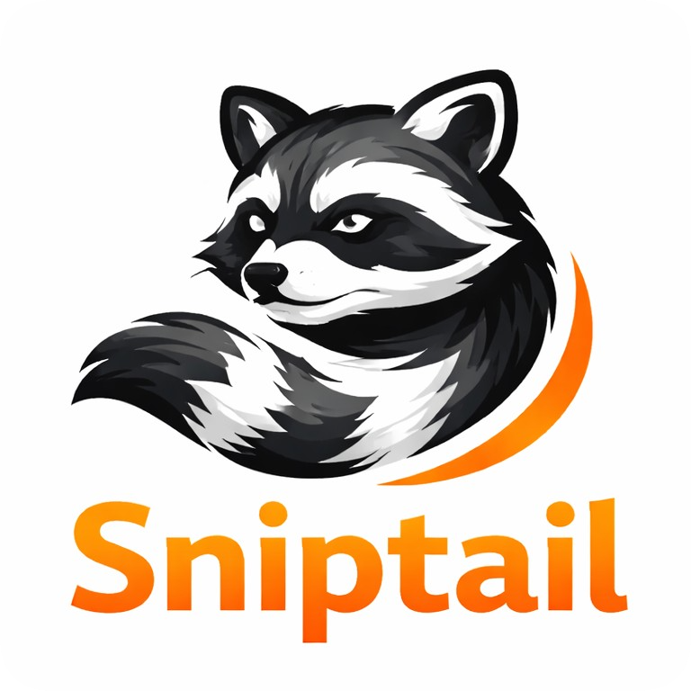

<p align="center">
  
</p>
<p align="center">
  <strong>Bring your codebase into the conversation.</strong><br />
  <em>Or any codebase, really.</em>
</p>

Sniptail is an omnichannel bot that accepts slash commands, runs coding agent jobs against approved repos, and posts back reports or merge requests. Slack and Discord are the currently supported channels. It is designed for teams that want a lightweight, self-hosted automation loop for repo analysis and changes.

## Bot mention

You can also mention the bot directly in a channel to kick off work without remembering a slash command. This is the simplest "wow" moment: mention the bot, ask a quick question, and it will casually check the configured repositories and answer in natural language right where it was mentioned.

## Quickstart

This quickstart assumes:

- bot and worker run on the same machine
- one shared `.env` file is used for both
- Codex CLI is installed, configured, and authenticated on your machine (`codex` works in your shell)
- you want to test with this repository: `git@github.com:Justkog/sniptail.git`

### 1) Install and prepare config

```bash
curl -fsSL https://raw.githubusercontent.com/Justkog/sniptail/main/install.sh | bash
cp ~/.sniptail/current/.env.example ~/.sniptail/current/.env
```

Edit `~/.sniptail/current/.env` and set at least:

- `REDIS_URL`
- `DISCORD_BOT_TOKEN`
- `GITHUB_API_TOKEN` (recommended for GitHub PR creation)

If you do not already have Redis running, start one quickly with Docker:

```bash
docker run -d --name sniptail-redis -p 6379:6379 redis:7-alpine
```

Then set `REDIS_URL=redis://127.0.0.1:6379` in `~/.sniptail/current/.env`.

Need help creating a basic Discord bot/token? See `docs/discord-bot-setup.md`.

### 2) Enable Discord in bot config

Edit `~/.sniptail/current/sniptail.bot.toml` and set:

```toml
[channels.discord]
enabled = true
app_id = "YOUR_DISCORD_APPLICATION_ID"
```

### 3) Add the `sniptail` repo to the catalog

```bash
sniptail repos add sniptail --ssh-url git@github.com:Justkog/sniptail.git
sniptail repos list
```

### 4) Start bot and worker

Run in two terminals:

```bash
sniptail bot
```

```bash
sniptail worker
```

### 5) End-to-end check in Discord

In a Discord server where the bot is installed, run:

```text
/sniptail-ask
```

Then, in the Discord modal that opens:

- write your request in the `question` input, for example:

```text
I'm about to confidently mis-explain /sniptail-ask. Walk me through only that flow from command to final message, no side quests.
```

- submit the modal

Expected result:

- Sniptail queues a job when you submit it.
- Worker clones/prepares `git@github.com:Justkog/sniptail.git`.
- Agent runs and produces a Markdown report.
- Bot posts the report and completion message back in the same Discord channel/thread.

For deeper setup and operations documentation, see `docs/setup-and-operations.md`, `docs/chat-commands.md`, `docs/project-roadmap.md`, and `docs/sniptail-cloud-faq.md`.

## Project direction

Sniptail is meant to grow along three axes: where requests come from, which coding agent executes them, and which Git service receives the results. Today, its omnichannel layer is implemented for Slack and Discord, alongside Codex/GitHub_Copilot and GitHub/GitLab integrations. The goal is to make each layer pluggable so other platforms can be added without rewriting the whole stack.

> **Sniptail is source-available, self-hostable, and free to use and modify.**
>
> We are actively working on **Sniptail Cloud**, a hosted and managed offering for teams that want to use Sniptail without running bots, queues, or workers themselves.
>
> Sniptail Cloud is **not available yet**. If you're interested in early access or updates, you can join the waitlist here: **[\[link\]](https://forms.gle/r5XiMVScEniHkcTVA)**

Roadmap detail tables are in `docs/project-roadmap.md`.

## How it works (high level)

1. A user triggers a slash command or mentions the bot in Slack or Discord.
2. The bot queues a job in Redis and records metadata in the configured job registry (Redis recommended).
3. A worker pulls the job, prepares repo worktrees, and runs the configured coding agent (Codex or Copilot).
4. Results are posted back to Slack or Discord as a report and (for IMPLEMENT jobs) a GitLab MR or GitHub PR.

## Why not just use Copilot or Codex?

AI coding assistants like Copilot and Codex are excellent for deep, hands-on technical work. They live in the editor, helping engineers write, refactor, and reason about code.

Sniptail doesn't replace them - it runs them on your behalf.

Instead of being tied to one developer's IDE, Sniptail turns those same agents into a team-facing automation layer:

- Ask questions about how a feature works - directly from Slack or Discord
- Explore product capabilities without digging through the repo
- Help onboard new team members who aren't technical
- Generate reports, plans, or lightweight PRs
- Do it all without installing or configuring anything locally

Copilot and Codex empower individual engineers to go deep.
Sniptail empowers the whole team to understand and safely interact with the codebase - using those same agents under the hood.

## License

Sniptail is licensed under the Elastic License v2.

You are free to:
- Use Sniptail for personal or internal business purposes
- Self-host Sniptail
- Modify the source code
- Distribute unmodified or modified copies

You may not:
- Offer Sniptail as a hosted or managed service to third parties
- Provide Sniptail as part of a commercial SaaS offering without permission

If you are interested in a hosted or managed version, see `docs/sniptail-cloud-faq.md`.
